**MeshVines: Zigbee® Temperature, Humidity and CO2 Wireless Sensor Network**

**Project Overview**

This project represents senior design work of undergraduates in the Electrical Engineering Department at the University of California, Davis.  The goal of this project was to create a Zigbee sensor network to monitor the temperature, humidity and CO2 in a winery. 

**Main Components**

Texas Instruments

* CC1352r Wireless MCU

* TPS22860 Ultra-Low Leakage Load Switch

* TPL5111 Nano-Power System Timer

* TPS61291 DC-DC Boost

* HDC1080 Ultra-Power Temperature Humidity Sensor

COZIR

* GC-0012 5,000 ppm CO2 Sensor

Polycase

* SN-29

* SN-22

* ML-44F

**Design Features**

* Battery Life of 23 months

* 3% Relative Humidity Accuracy

* Temperature Accuracy

* 50 ppm CO2 Accuracy

* Unit cost less than $35 at 30 units

* Zigbee Mesh Network

- [System Description](#heading)
  * [Sub-heading](#sub-heading)
    + [Sub-sub-heading](#sub-sub-heading)
- [Heading](#heading-1)
  * [Sub-heading](#sub-heading-1)
    + [Sub-sub-heading](#sub-sub-heading-1)
- [Heading](#heading-2)
  * [Sub-heading](#sub-heading-2)
    + [Sub-sub-heading](#sub-sub-heading-2)

[System Description](#section-1)

Temperature, humidity and CO2 are important parameters for wineries to monitor. Temperature provides important feedback on the health of the building's HVAC systems, while humidity is directly correlated to evaporation of wine as it ages in barrell rooms.  By both monitoring and controlling for humidity, this loss of wine, and ultimately revenue, can be minimized.  Additionally, during the fermentation of wine, sugar in juice is converted to alcohol and CO2 is produced as a byproduct.  Since it is denser than air, CO2 can linger in pockets of a building and poses a serious health risk to employees.  Current measurement systems often consist of a single sensor or a hand-held device that requires an employee to manually walk around to check CO2 levels.  This project provides a cost-effective solution for wineries to monitor these parameters with a high temporal and spatial resolution. 

## **1.1	Temperature, Humidity and CO2 Sensors**
[**1.1	Temperature, Humidity and CO2 Sensors**](#subsection-a)
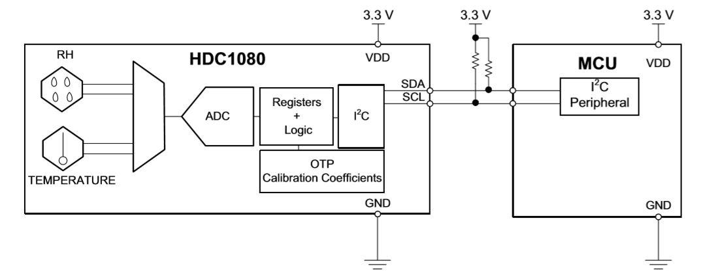

Fig 1. HDC1080 Block Diagram

The HDC1080 temperature and humidity sensor from Texas Instruments was chosen for its high accuracy and low power, drawing only 1.3 uA for an 11-bit measurement.  Additionally, it comes with an I2C interface and a 3 mm x 3 mm footprint.

The COZIR GC-0012 CO2 sensor was chosen for its high accuracy and low power.  The COZIR uses Non-dispersive infrared (NDIR) to measure the CO2 in ppm to within 30ppm.  The COZIR CO2 sensor comes in different versions that can measure up to 2,000, 5,000, and 10,000 ppm.  Outdoor air typically ranges from 300 to 500 ppm. The OSHA Permissible Exposure Limit for 8-hour exposure is 5,000 ppm, therefore the 5,000 ppm measurement range of this sensor was chosen.  The COZIR CO2 sensor also features a fast response time of 1.2 seconds, making it attractive for use in a low power system.

## 1.2	Ultra-Low Power Wireless Microcontroller (MCU)

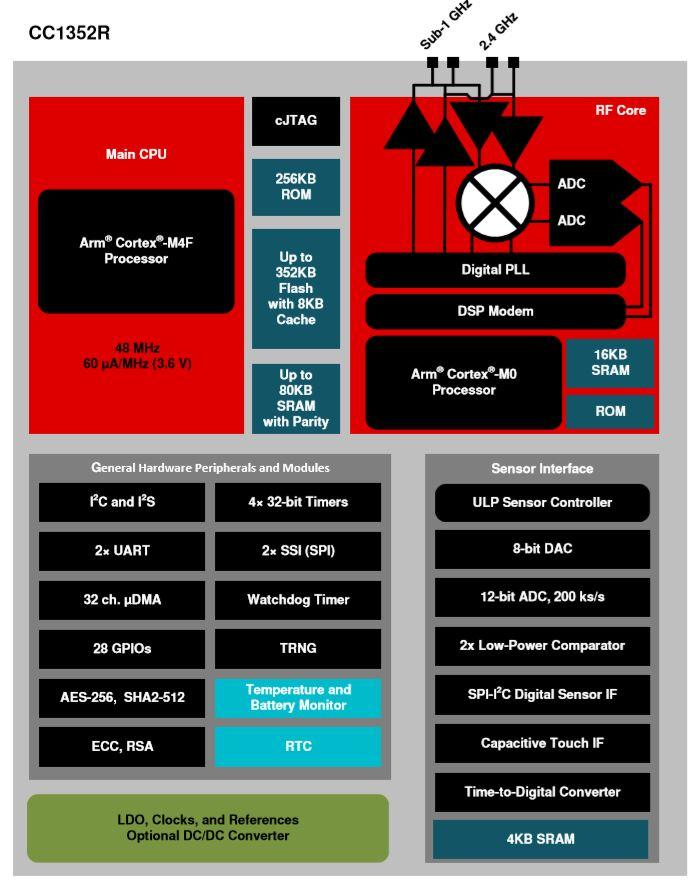

Fig 2. CC1352r Block Diagram

To collect data from sensors and transmit to a central node, a radio and processor is necessary and must be low power.  The CC1352r was chosen for this application.  As a part of TI’s SimpleLink(tm) ultra-low power wireless microcontroller (MCU) platform, software development is standard across this family of devices.  In addition, a Zigbee 3.0 device can be created quickly with the provided Z-Stack software resources from TI. The CC1352r is a multi-standard device that supports a wide range of communication protocols including IEEE 802.15.4 for Zigbee.

## 1.3	Nano-Power System Timer

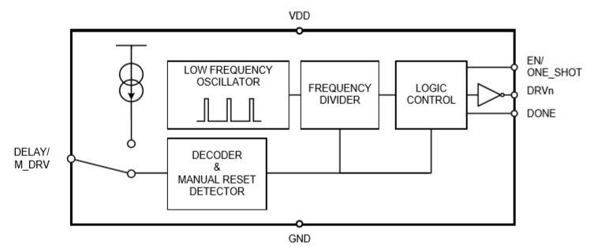

Fig 3. TPL5111 Block Diagram

To maximize battery life, a nano-power system timer is used.  The use of this device replaces the internal timer of any standard microcontroller with a discrete analog system timer that consumes much less power than the microconteroller’s internal timer.  The external timer can then be used to bring an MCU out of sleep mode through a pin interrupt, or to completely shut off power to the system.

In this design the TPL5111 nano-power system timer is used to control both the boost converter mode and load switch, reducing the off-state current drawn from the battery to the order of nanoamps.  The timer interval is selectable by an external resistor, and was chosen to be 100kohm || 100kΩ to give about 7 mins time intervals, or the can be selected as a function of the resistance of the potentiometer.

## 1.4	Boost Converter

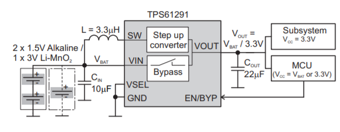

Fig 4. Simplified Schematic of the TPS61291

The TPS61291 was chosen to boost battery voltage from 3V to 3.3 V. This allows for the microcontroller to be powered via 2 AAA batteries. Additionally, the integrated bypass mode of the TPS61291 allows for maximum battery life by reducing current draw from the battery when 3.3 V is not needed.

## 1.5	Low-Leakage Load Switch

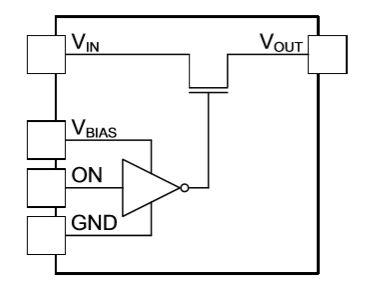

Figure 5. TPS22860 Functional Block Diagram

In conjunction with a non-power system timer, a low-leakage load switch is used to shut off power to the CC1352r and sensors.  The TPS22860 device was chosen for its rated leakage current of +- 20nA at 25C, enabling long battery life.

## 1.6	IFA Antenna

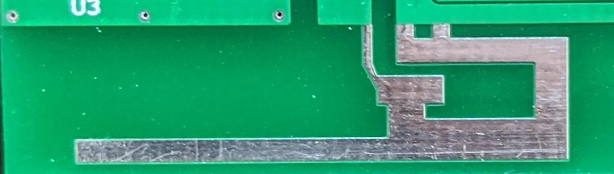

Fig 6. Implemented 2.4 GHz Inverted-F PCB Trace Antenna

In any low-power wireless embedded system, the wireless transmission of data will very likely represent the largest power cost.  The TX power of the CC1352r is selectable from -20 to +5 dbm.  Decreasing this power allows the battery life to be extended.  By optimizing the antenna efficiency, the TX power can be minimized while still maintaining an acceptable range.  For this device, an Inverted-F PCB trace antenna antenna (IFA) was simulated in HFSS and then measured in the enclosure and operating environment.  A PCB trace antenna also has the benefit of having no cost, as the antenna is built into the PCB. Measurement results are discussed in section 3.5.

## 1.7	Power Methods

All boards are powered through some combination of 2 x AAA batteries, CR2032 coin-cell battery, 18650 Li-Ion battery or 2 x 5.55 mm barrel jack 

# 2	System Design Theory and Considerations

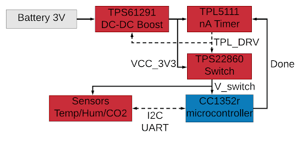

Fig 7. Low-power block diagram

A battery powered sensor node will have two main states: on and asleep. In the off state, the battery is completely disconnected from the microcontroller and sensors by the TPS22780 switch being open. Additionally, the TPS61291 DC-DC Boost is operating in bypass mode. Overall, the off state current draw is in the nA range.

When the timing interval on the nano power system timer has ended, the TPS22860 switch is closed, connecting the battery to the microcontroller and sensors. The DC-DC Boost is also put into boost mode, bringing the voltage to 3.3V. When the microcontroller has finished its tasks of collecting and transmitting sensor data, a GPIO pin (Done) connected to the nano power timer is written high, opening the switch and bringing the system back to the off state.

## 2.1	Duty-Cycled Power Calculations

Our system uses a duty cycle (turning the device "on" for a percentage of a periodic time interval) in order to extend the battery life of our devices. We can calculate a battery life estimate by using the following equation:

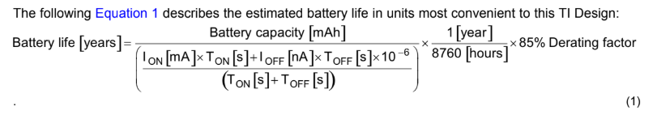

where the derating factor is used to account for variations in the battery’s capacity due to leakage current or the environment.

## 2.2	Firmware

Software for all Zigbee nodes was developed in Code Composer Studio (CCS).  Nodes are a part of the HVAC cluster and include uint16 attributes for temperature, humidity and CO2.  When data temperature and humidity reach the coordinator, the uint16 value is converted to a ℃ and %RH value through the following equation and sent via UART to the BeagleBone Black:

## 2.3	Zigbee Network

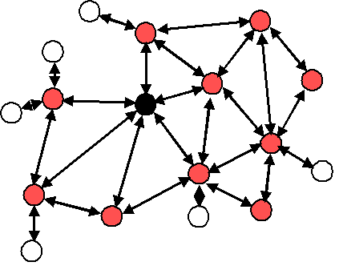

           Figure 8. Typical Zigbee Mesh topology. White circles represent end

           nodes, red circles represent routers, and the black circle 

           represents a coordinator

Our sensor network takes advantage of Texas Instruments Zigbee Stack (Z-Stack) application. ZigBee is a IEEE 802.15.4 based, low power, low data rate supporting wireless networking standard, typically useful for two-way communication between sensors and control systems. By implementing a zigbee mesh network, we can exploit favorable properties other network designs lack such as a self healing and low powered network. 

Zigbee mesh networks consist of three main devices - end nodes, routers, and typically a single coordinator. Coordinators can create networks and add devices to the network once created. Since all the information from the end nodes get sent to the coordinator, the coordinator is connected to our gateway where the data can be collected on cloud devices.The routers main function is to relay information from the end node to the coordinator. They also have network creating capabilities but they are not used for our purposes. Finally end nodes are the hardware that sample data and send to routers.

## 2.4	Zigbee Gateway

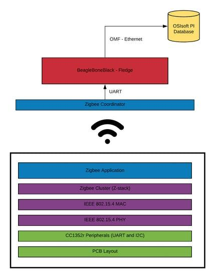

Fig 9. OSI Model

The linux gateway is a BeagleBone Black running Ubuntu 18.04 LTS for armv7l. 

The cloud server used is OSIsoft’s PI Server. The gateway communicates to the server using Osisoft message format (OMF). Fledge is an open source framework focused for industrial IoT applications. Fledge is a suite of microservices that allow for rapid deployment of light-weight modules to extend the software’s functionality. We chose this software because omf support in its builtin package. 

The gateway communicates with the zigbee coordinator using UART protocol. Adafruit BeagleBoneBlack drivers and pySerial are installed. Using these two packages, the south plugin is written according to the plugin developer guide. 

Once the data collected by fledge, the fledge-north-omf plugin would send the data to the cloud. We needed assistance gaining credentials to communicate with the server, but that was in the scope of winery IT and OSIsoft licensing.  

## 2.5	Antenna Design

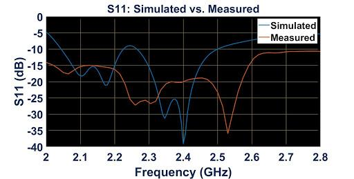

Fig 10.  S11: Simulated vs. Measured

# 3	Hardware Versions

To achieve high performance in a variety of implementation settings, multiple devices were created.  The naming of these these devices is the following:

* MeshVines_ZigbeeActor_MeasurementParameter_PowerInput&mAh

    * MeshVines_CoordinatorRouterEnd_TempHumCO2_WallBatteryxxxx

        * MeshVines_RE_THC_WB1000

        * MeshVines_RE_TH_WB220

        * MeshVines_C_W

        * MeshVines_R_TH_WB_5200 

## 3.1	Hardware Overview

<table>
  <tr>
    <td>Device Name - External (NEW)</td>
    <td>Hardware Name-Internal Name (OLD)</td>
    <td>Type</td>
    <td>Enclosure (Polycase)</td>
    <td>Battery</td>
    <td>Sensing</td>
    <td>Capacity</td>
  </tr>
  <tr>
    <td>MeshVines_RE_THC_WB1000</td>
    <td>MeshVines V3</td>
    <td>Router/End</td>
    <td>SN-29</td>
    <td>2 x AAA</td>
    <td>Temp, Hum, CO2</td>
    <td>1000 mAh</td>
  </tr>
  <tr>
    <td>MeshVines_RE_TH_WB220</td>
    <td>MeshVines_TempHum_V1</td>
    <td>Router/End</td>
    <td>SN-21 or SN-22</td>
    <td>CR2032</td>
    <td>Temp, Hum</td>
    <td>220 mAh</td>
  </tr>
  <tr>
    <td>MeshVines_C_W</td>
    <td>MeshVines_BBB_Coordinator_Cape</td>
    <td>Coordinator (cape for BBB)</td>
    <td>ML-44F</td>
    <td>None (Powered through BBB)</td>
    <td>N/A</td>
    <td>N/A</td>
  </tr>
  <tr>
    <td>MeshVines_R_TH_WB5200</td>
    <td>MeshVines_Router_Battery</td>
    <td>Router</td>
    <td>SN-29</td>
    <td>2 x 3.7V Lithium-Ion</td>
    <td>Temp, Hum</td>
    <td>5200 mAh</td>
  </tr>
</table>

### 3.1.1	MeshVines_RE_THC_WB1000

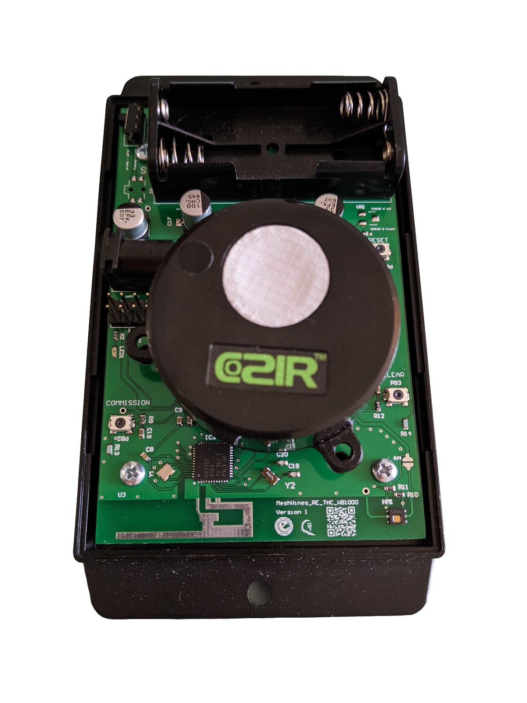

Fig 11. MeshVines_RE_THC_WB1000

MeshVines_RE_THC_WB1000 is mainly used as an end node in the Zigbee mesh network and can measure temperature, humidity and CO2.

MeshVines_RE_THC_WB1000 has the following features:

* 2 x AAA batteries

* Inverted-F 2.4 GHz PCB trace antenna

* Commission, Clear, and Reset buttons

* Power status LED

* Switch to select the input power supply

* 2 x 5.5 mm barrel connector for 5 V input

* HDC1080 for temperature and humidity measurement

* COZIR 5,000 ppm for CO2 measurement

* Low power architecture for maximizing battery life

* Polycase enclosure SN-29

### 3.1.2	MeshVines_RE_TH_WB220 

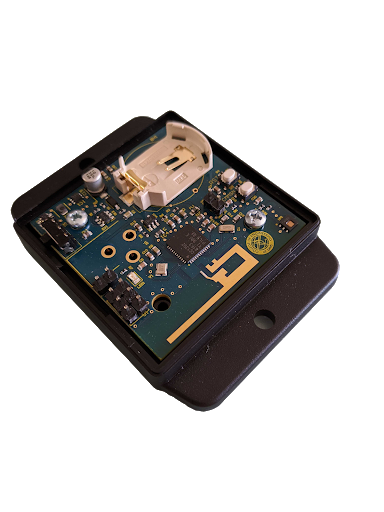

Fig 12. MeshVines_RE_TH_WB220

MeshVines_RE_TH_WB220 is mainly used as an end node in the Zigbee mesh network, and can measure temperature and humidity.

MeshVines_RE_TH_WB220 has the following features:

* CR2032 Battery

* Inverted-F 2.4 GHz PCB trace antenna

* Commission and Reset buttons

* Power status LED

* Switch to select the input power supply

* 2 x 5.5 mm barrel connector for 5 V input

* HDC1080 for temperature and humidity measurement

* Low power architecture for maximizing battery life

* Polycase enclosure SN-21 or SN-22

### 3.1.3	MeshVines_C_W

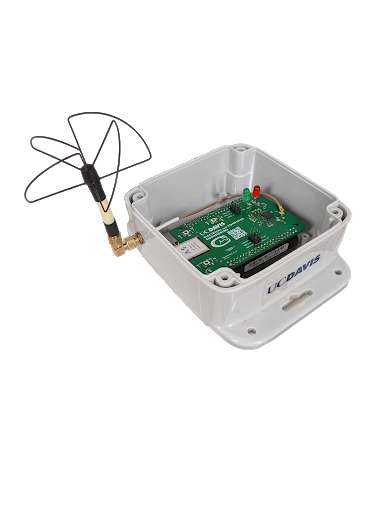

Fig 13. MeshVines_C_W

MeshVines_C_W is used as the coordinator in the Zigbee mesh network, and is designed to fit into the header pins of a BeagleBone Black (BBB).

MeshVines_C_W has the following features:

* Header pins to fit onto BeagleBone Black

* uFL connector for 2.4 GHz antenna

* Commission, Clear and Reset buttons

* LED for commissioning countdown

* LED for indication of received packets

### 3.1.4	MeshVines_R_TH_WB5200

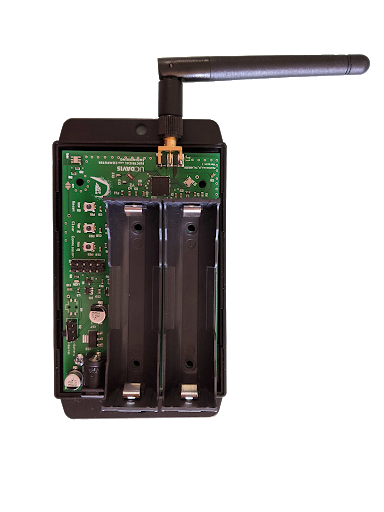

Fig 14. MeshVines_R_TH_WB5200

In an industrial environment such as a winery, one cannot rely on a conveniently placed outlet to power a Zigbee router.  Therefore, MeshVines_R_TH_WB5200 was created to allow a router to be powered off battery for up to 2 months.  If an uninterruptible power supply is used for the Zigbee coordinator, then the entire network can run independently of the building's infrastructure.  In the event of a power outage or network disruption, the coordinator can buffer data locally until the power or network disruption is resolved.

MeshVines_R_TH_WB5200 has the following features:

* 2 x 18650 battery holders in parallel

* 2 x 5.5 mm barrel connector for 5 V input

* Side mount PCB SMA connector for 2.4 GHz antenna

* Commission, Clear and Reset buttons

* Switch to select the input power supply

* Power indicator LED

# 4	Implementation Results and Characterization

The system was installed in 2 locations, the Jess S Jackson Sustainable Winery Building (Section 5.1) on the UC Davis campus and an apartment (Section 5.2) to collect data for approximately 1 week each.

## 4.1	Jess S Jackson Sustainable Winery Building Results

Fig 15. Jess S Jackson Sustainable Winery Building

This project was implemented in the Jess S Jackson Sustainable Winery Building on the UC Davis campus. From the UC Davis Viticulture and Enology website, "The Jackson Sustainable Winery Building is designed to never drop below 50°F (10°C) or above 80°F (27°C ) even during the hot summers found in Davis. Temperature is controlled by efficient night air cooling in summer and warm day heating in winter. Windows near the peak of the slanted ceiling open automatically at night during the summer to allow natural circulation of the air through a fan that introduces the cool nighttime air near the floor. Hot or cold water can be circulated to heat or cool the floor slab of the building via tubes within the slab.” In addition to its LEED platinum certification, this building houses many ongoing projects in sustainable design of wineries and is an important part of UC Davis being the most sustainable campus in the world (UI GreenMetric World University Ranking, 2016).

Data is collected from nodes and recorded into a csv at the coordinator to be processed by MATLAB later

### 4.1.1	Node Placement

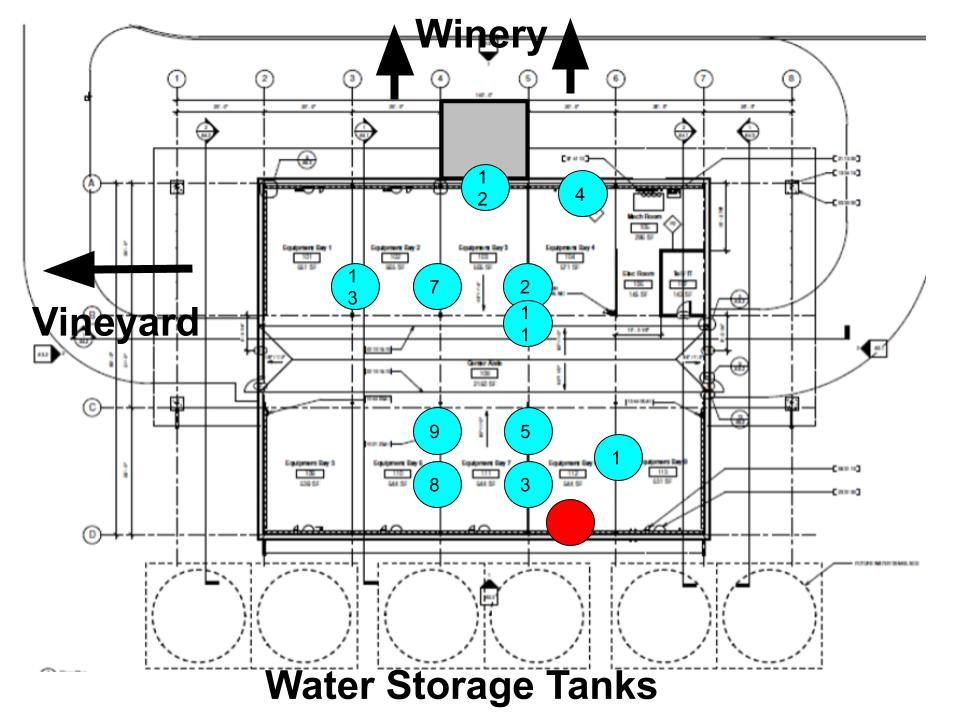

Fig 16. Jess S Jackson Sustainable Winery Building Node Placement

### 4.1.2	Recorded Data

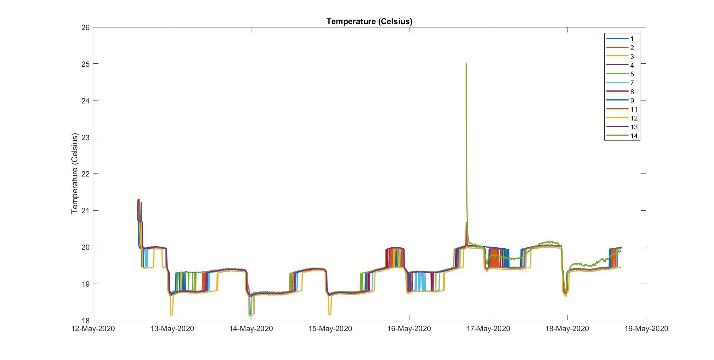

Fig 17. Jess S Jackson Sustainable Winery Building Recorded Temperature

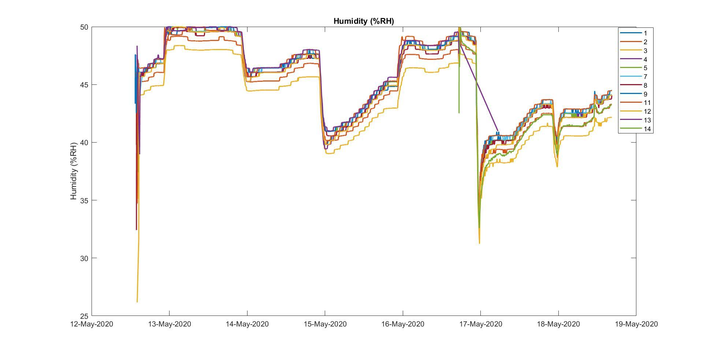

Fig 18. Jess S Jackson Sustainable Winery Building Recorded Humidity

Between May 16 and May 17, node 14 is added.  Additionally this node contains a software update to take 3 samples and send the most recent sample.  This correlated to a smoother temperature and humidity curve.

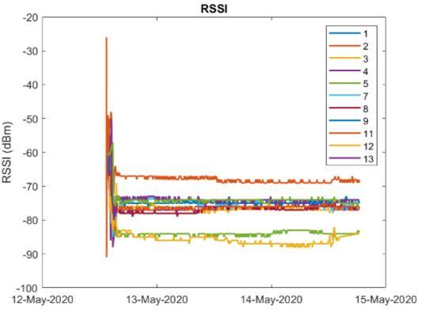

Fig 19. Jess S Jackson Sustainable Winery Building Recorded RSSI

Received Signal Strength Intensity (RSSI) was also recorded and is measured in dBm.

## 4.2 	Apartment Building Results

Data is collected from end nodes and sent to an OSIsoft database via Fledge.

### 4.2.1	Node Placement

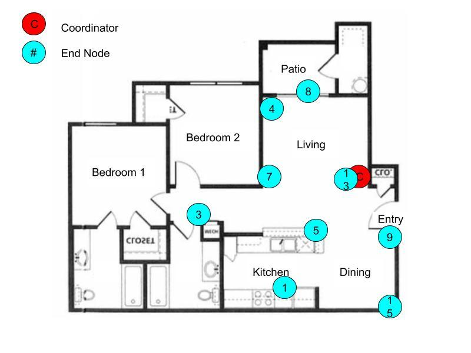

Fig 20. Apartment Node Placement

### 4.2.2	Recorded Data

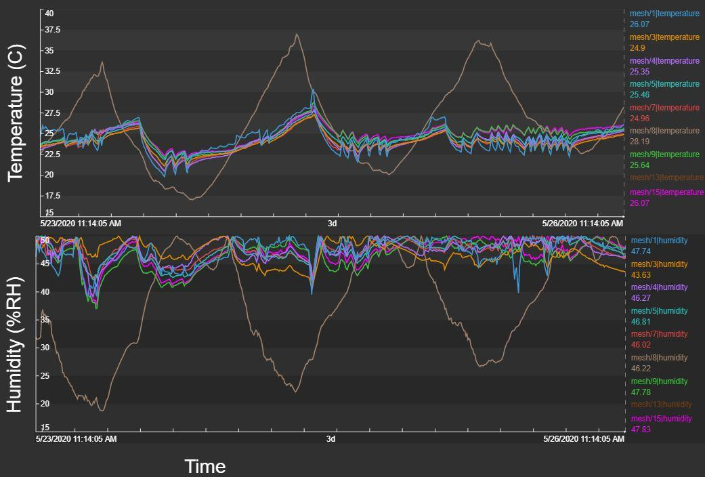

Fig 21. Apartment Recorded Temperature and Humidity

Node 8 (brown) was placed outside for reference and reflects diurnal periodicity.  Additionally, node 1, which is placed in the kitchen, shows higher temperature for certain parts of the day.

## 4.3	Power Consumption

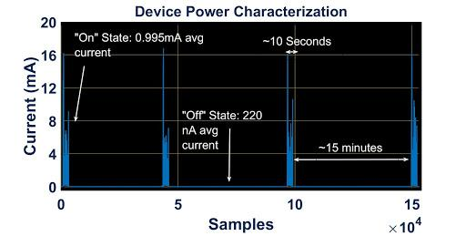

Fig 22. Measured Current on MeshVines_RE_TH_WB220

Our sensor end nodes save power by using a duty cycle to control how long and how often the devices are powered on for.  Accurate analysis of the power consumption of our end nodes is essential to maximizing the battery life of our devices. To measure the power consumption of our devices, we used the Otii Arc® to measure the current draw by our end nodes while they are collecting and transmitting data (the "on-state") and while the device is not active (the “off-state”). 

### 4.3.1	On-State Power Characterization

The on-state of an end node is when the device sampling data from the onboard sensors and transmitting this data to a router node, we found the average on-state current of MeshVines_RE_TH_WB220 to be 1 mA. The device is active in this state for 10 seconds.

### 4.3.2	Off-State Power Characterization

When a device is not actively sampling, MeshVines_RE_TH_WB220 draws 220 nA.

### 4.3.3	Estimated Battery Life Calculations

Based on the on-state and off-state current, powering the device by a common 2032 coin cell battery, and given a sampling duration of every 15 minutes, the expected battery life of an end node device is 23 months.

## 4.4	Verification of Mesh Network

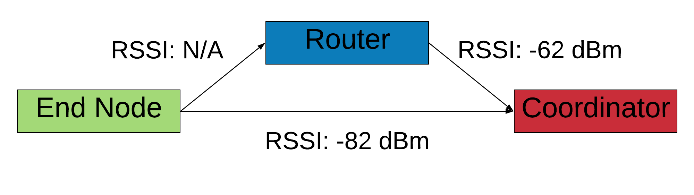

Fig 23. Data Path for Verification of Mesh Network

The Zigbee network was verified as a mesh by forcing data through 2 paths and observing the RSSI on the coordinator.  By powering the router on the off, the path is also switched, demonstrating the self-healing nature of a Zigbee mesh network.

## 4.5	Cost Analysis

<table>
  <tr>
    <td>Device</td>
    <td>Cost per unit</td>
    <td>Total cost</td>
  </tr>
  <tr>
    <td>MeshVines_RE_THC_WB1000
</td>
    <td>$155.53 (with CO2 sensor)
$46.53 (without CO2 sensor)</td>
    <td></td>
  </tr>
  <tr>
    <td>MeshVines_C_TH_W </td>
    <td>$25.69</td>
    <td></td>
  </tr>
  <tr>
    <td>MeshVines_R_TH_WB5200</td>
    <td></td>
    <td></td>
  </tr>
  <tr>
    <td>MeshVines_RE_TH_WB220</td>
    <td></td>
    <td></td>
  </tr>
</table>

# 5	Conclusion

This project demonstrates the scalability of a large sensor network through low power design, a mesh topology, low cost and consideration of antenna design.  By using Fledge to manage data into the cloud, the system addresses common industrial IoT security concerns.

# 6	Team Members

# 

# 7	Acknowledgements

The support of this project was made available by Opus One Winery and Texas Instruments and was performed in collaboration with the Robert Mondavi Institute for Wine and Food Science.

# 8	References

